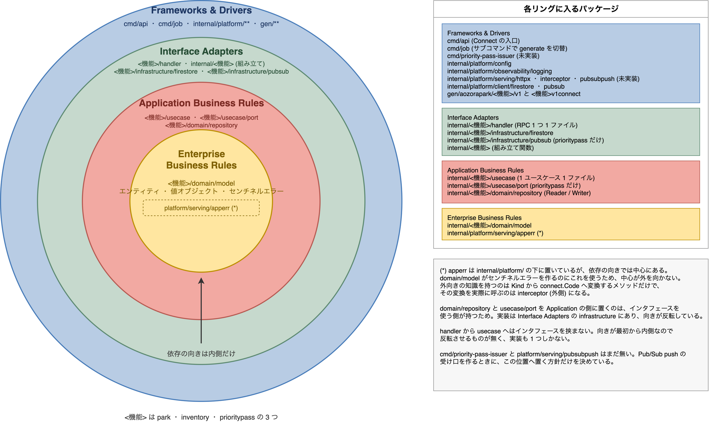
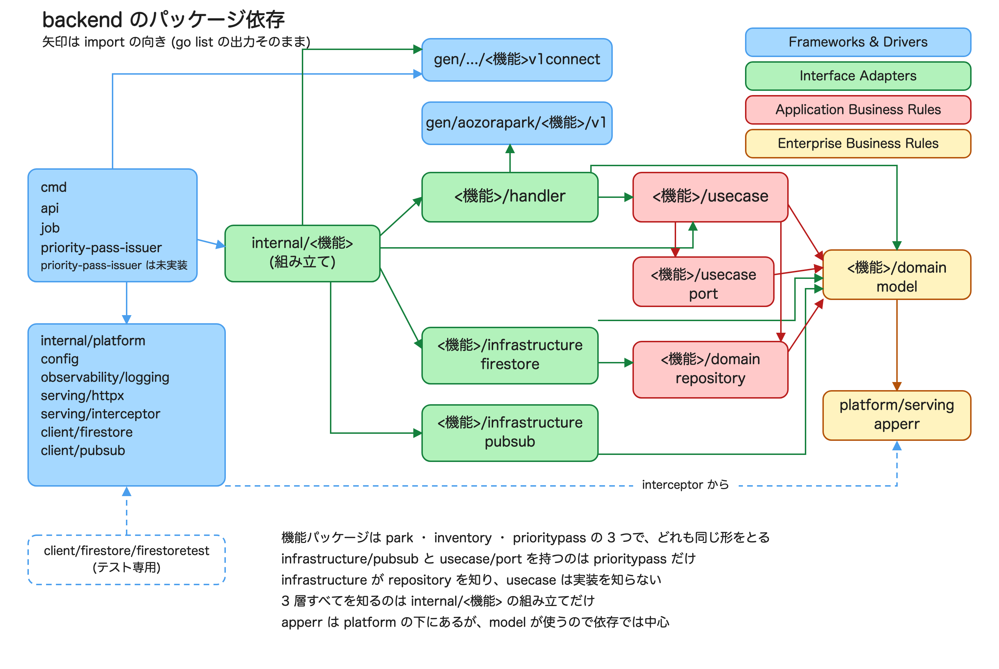

# Backend package layout

[English](./README.md) | [日本語](./README.ja.md)

Back to the [documentation index](../../README.md).

This page describes how `backend/` is structured internally. The rules live in `.claude/rules/go/coding.md`; this page records the current shape and why it was chosen.

## Layers and the direction of dependencies

The outer split is by business feature, and each feature is split into layers. Only inward dependencies are allowed.



| Ring                       | Packages                                                                                                                    |
| -------------------------- | --------------------------------------------------------------------------------------------------------------------------- |
| Enterprise Business Rules  | `<feature>/domain/model`, `platform/serving/apperr`                                                                         |
| Application Business Rules | `<feature>/usecase`, `<feature>/usecase/port`, `<feature>/domain/repository`                                                |
| Interface Adapters         | `<feature>/handler`, `<feature>/infrastructure/firestore`, `<feature>/infrastructure/pubsub`, `internal/<feature>` (wiring) |
| Frameworks & Drivers       | `cmd/api`, `cmd/job`, `internal/platform/**`, `gen/**`                                                                      |

The feature packages are `park`, `inventory` and `prioritypass`, and all three have the same shape.
Only `prioritypass` has a `usecase/port` and an `infrastructure/pubsub`.

`cmd/job` is one binary whose subcommand selects the work. The only one so far is the slot pre-generation (`generate`).

`cmd/priority-pass-issuer`, which receives the priority pass allocation, and `platform/serving/pubsubpush`, which unwraps the Pub/Sub push envelope, are not there yet.
Only where they go is decided, in `.claude/rules/go/coding.md`.

## Dependencies between packages

Arrows point the way imports go. The graph comes from the output of `go list`.



To look the current state up again:

```sh
cd backend
go list -f '{{range .Imports}}{{.}}{{end}}' ./internal/park/usecase   # what this package knows
go list -f '{{.ImportPath}} {{.Imports}}' ./... | grep park/domain/model  # who knows this package
```

## apperr is the one package whose ring does not match its directory

`platform/serving/apperr` sits in the outer `internal/platform/` directory, but in terms of dependencies it belongs at the centre: `domain/model` uses it to build its sentinel errors.

Its only outward-facing knowledge is the method that maps a `Kind` to a `connect.Code`, and the caller of that method is `interceptor`, on the outside. The diagram places it at the centre with a dashed border.

## Recorded decisions

**No interface between `handler` and `usecase`.** That dependency already points inward, so there is nothing to invert, and each contract has exactly one implementation. Go does not require the implementation to declare anything, so the interface can be introduced on the `handler` side the moment it is needed: when a second implementation appears (caching, a feature flag), or when a `handler` test needs to replace the whole use case.

**`infrastructure/firestore` keeps the technology in its name.** The abstract names belong to `Reader` and `Writer` in `domain/repository`. Naming the implementation `datastore` would leave no room for a second one, and the role is already expressed by the type name (`firestore.Repository`).

**`ParkID` is the only value object in `park`.** The display name, the daily capacity and the number of days never leave `Park` on their own, so wrapping them would only add conversions. Having a validation rule is not on its own a reason to introduce a type.

**`inventory` holds two entities in one feature package.** The daily admission inventory (`DateInventory`) and the attraction time slot (`TimeSlot`) are separate aggregates, but both are decremented and restored by the same inventory operations. The methods on `domain/repository` carry the entity name as a prefix (`GetDateInventory`, `ListTimeSlots`, `UpdateDateInventory`) to tell them apart.

**`inventory` turns its identifiers and its date into value objects.** `ParkID`, `AttractionID`, `TimeSlotID` and `Date` are passed side by side as strings into the repository methods, where swapping two of them would still compile. The start time, the capacity and the remaining count never leave `DateInventory` or `TimeSlot` on their own, so they stay primitive.

**`inventory` never creates a slot.** `domain/model` only offers `RestoreDateInventory` and `RestoreTimeSlot`. Slots are created ahead of time by a job, so adding a `New` here would give creation two entry points.

**Only `prioritypass` has a `usecase/port`.** Persistence belongs to `domain/repository`, but publishing is not persistence. The port lists only the methods the caller needs, and `infrastructure/pubsub` implements it. `park` and `inventory` touch nothing but Firestore, so they have no such layer.

**A failed publish does not roll the request back.** Recreating an already created request would mean a duplicate, so a failed send is logged instead of returned as an error. A successful send is recorded in `publishedAt`, which leaves the ones that were never sent to be picked up later.

**The publish is detached from the caller's ctx and given a deadline.** While the destination is unreachable the SDK keeps retrying, so without a deadline the request takes that much longer to answer. Measured, an RPC that took 60.3 seconds without one came down to 3.02 seconds with `context.WithoutCancel` and a 3 second `context.WithTimeout`.

**Feature packages do not import each other; they read each other's documents through their own structs.** `inventory` reads the master data `park` wrote, and `prioritypass` reads the time slots `inventory` wrote. Neither uses the other's `domain/model`: each keeps a struct of just the fields it needs. `DataTo` drops fields the struct does not declare, so adding a field on the writing side breaks nothing.

The cost is that a collection path and a field name now live in two places. Changing only one of them goes unnoticed when the implementation and the test helper read the same constant, so a test compares the assembled path against a literal (`TestRepositoryTimeSlotDocPath`). Once a third reader appears, this arrangement is worth revisiting.

## Regenerating the diagrams

```sh
# Concentric rings (-p is the page number, counted from 1)
drawio --no-sandbox -x -f png -s 2 -p 1 -o images/layers.png images/layers.drawio
```

For the dependency graph, wrap `images/dependencies.svg` in an HTML page and screenshot it with headless Chrome.

```sh
printf '<!doctype html><meta charset="utf-8"><style>html,body{margin:0;background:#fff}</style>' > /tmp/dep.html
cat images/dependencies.svg >> /tmp/dep.html
"/Applications/Google Chrome.app/Contents/MacOS/Google Chrome" --headless --disable-gpu \
  --hide-scrollbars --force-device-scale-factor=2 --window-size=1420,950 \
  --default-background-color=FFFFFFFF --screenshot=images/dependencies.png /tmp/dep.html
```
