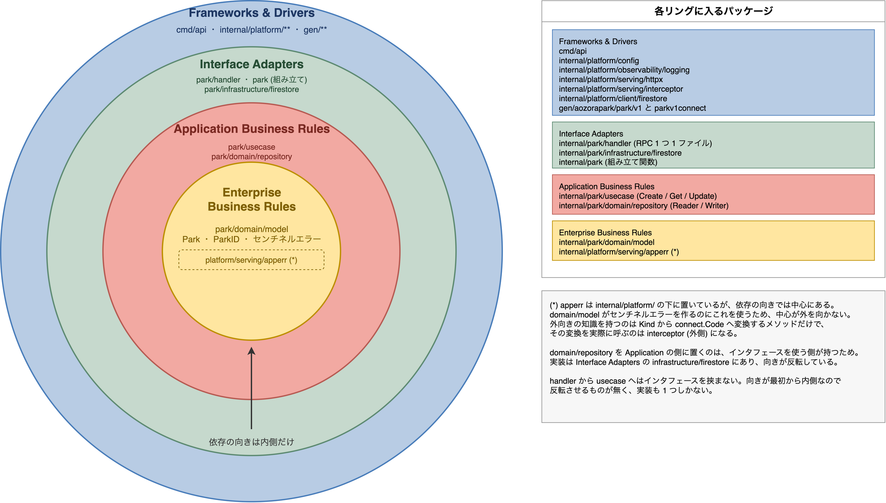
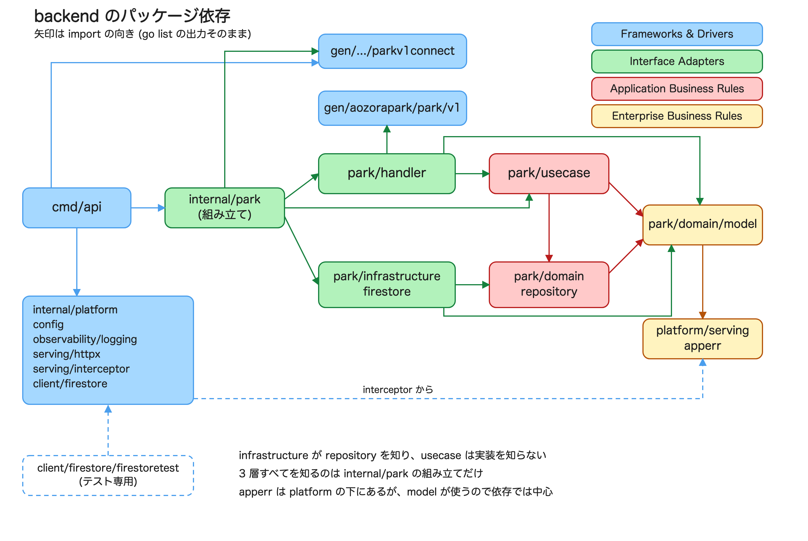

# Backend package layout

[English](./overview.md) | [日本語](./overview.ja.md)

Back to the [documentation index](../../README.md).

This page describes how `backend/` is structured internally. The rules live in `.claude/rules/go/coding.md`; this page records the current shape and why it was chosen.

## Layers and the direction of dependencies

The outer split is by business feature, and each feature is split into layers. Only inward dependencies are allowed.



| Ring                       | Packages                                                                  |
| -------------------------- | ------------------------------------------------------------------------- |
| Enterprise Business Rules  | `park/domain/model`, `platform/serving/apperr`                            |
| Application Business Rules | `park/usecase`, `park/domain/repository`                                  |
| Interface Adapters         | `park/handler`, `park/infrastructure/firestore`, `internal/park` (wiring) |
| Frameworks & Drivers       | `cmd/api`, `internal/platform/**`, `gen/**`                               |

## Dependencies between packages

Arrows point the way imports go. The graph comes from the output of `go list`.



To look the current state up again:

```sh
cd backend
go list -f '{{range .Imports}}{{.}}{{end}}' ./internal/park/usecase   # what this package knows
go list -f '{{.ImportPath}} {{.Imports}}' ./... | grep park/domain/model  # who knows this package
```

## apperr is the one package whose ring does not match its directory

`platform/serving/apperr` sits in the outer `internal/platform/` directory, but in terms of dependencies it belongs at the centre: `domain/model` uses it to build its sentinel errors.

Its only outward-facing knowledge is the method that maps a `Kind` to a `connect.Code`, and the caller of that method is `interceptor`, on the outside. The diagram places it at the centre with a dashed border.

## Recorded decisions

**No interface between `handler` and `usecase`.** That dependency already points inward, so there is nothing to invert, and each contract has exactly one implementation. Go does not require the implementation to declare anything, so the interface can be introduced on the `handler` side the moment it is needed: when a second implementation appears (caching, a feature flag), or when a `handler` test needs to replace the whole use case.

**`infrastructure/firestore` keeps the technology in its name.** The abstract names belong to `Reader` and `Writer` in `domain/repository`. Naming the implementation `datastore` would leave no room for a second one, and the role is already expressed by the type name (`firestore.Repository`).

**`ParkID` is the only value object.** The display name, the daily capacity and the number of days never leave `Park` on their own, so wrapping them would only add conversions. Having a validation rule is not on its own a reason to introduce a type.

## Regenerating the diagrams

```sh
# Concentric rings (-p is the page number, counted from 1)
drawio --no-sandbox -x -f png -s 2 -p 1 -o images/layers.png images/layers.drawio
```

For the dependency graph, wrap `images/dependencies.svg` in an HTML page and screenshot it with headless Chrome.

```sh
printf '<!doctype html><meta charset="utf-8"><style>html,body{margin:0;background:#fff}</style>' > /tmp/dep.html
cat images/dependencies.svg >> /tmp/dep.html
"/Applications/Google Chrome.app/Contents/MacOS/Google Chrome" --headless --disable-gpu \
  --hide-scrollbars --force-device-scale-factor=2 --window-size=1420,950 \
  --default-background-color=FFFFFFFF --screenshot=images/dependencies.png /tmp/dep.html
```
