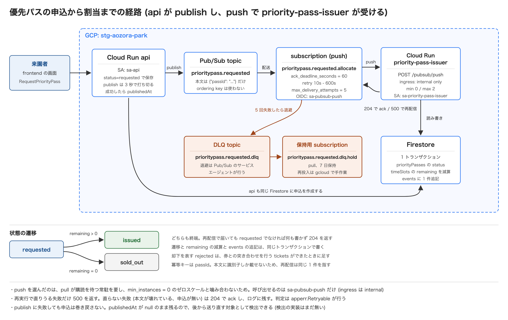

# 優先パスの Pub/Sub の経路

[English](./README.md) | [日本語](./README.ja.md)

[ドキュメント一覧](../../README.ja.md)に戻る。

優先パスの申込 (`api`) から割当 (`priority-pass-issuer`) までを Pub/Sub でつなぐ経路をまとめます。
規約は `.claude/rules/go/coding.md` と `.claude/rules/infra/coding.md` が持ちます。ここには現状と、その形を選んだ理由を置きます。

## 業務の流れ

来園者がアトラクションの時間帯枠に優先パスを申し込み、枠が残っていれば発行し、残っていなければ売り切れで終わります。

| 状態        | 意味                               | 書く主体               |
| ----------- | ---------------------------------- | ---------------------- |
| `requested` | 申込を受け付けた。割当を待っている | `api`                  |
| `issued`    | 枠を確保して発行した               | `priority-pass-issuer` |
| `sold_out`  | 枠が残っていなかった               | `priority-pass-issuer` |

`api` は枠に触れず `requested` のまま保存します。枠の確保は割当の処理だけが行うため、申込の RPC は在庫の状態に左右されません。
遷移を許すのは `requested` からの 1 回だけで、`issued` と `sold_out` はどちらも終端です。
却下を表す `rejected` は、券との突き合わせを行う `tickets` ができたときに追加します。

`events` には遷移を 1 件ずつ残します。`actor` は `api` と `system:priority-pass-issuer`、`action` は `created` と `status_changed`、
`cause` は `guest_requested` と `slot_allocated` と `slot_sold_out` です。状態そのものは `changes` が持ちます。

## 経路の全体像



| 区間                          | 何が起きるか                                                                              |
| ----------------------------- | ----------------------------------------------------------------------------------------- |
| 来園者 → `api`                | `RequestPriorityPass`。申込と `events` を 1 トランザクションで作成する                    |
| `api` → トピック              | `prioritypass.requested` へ publish する。送れたら `publishedAt` を埋める                 |
| トピック → サブスクリプション | `prioritypass.requested.allocate` が push で配送する                                      |
| → `priority-pass-issuer`      | `POST /pubsub/push`。OIDC トークンで `sa-pubsub-push` を名乗る                            |
| → Firestore                   | `priorityPasses` の遷移と `timeSlots` の減算と `events` の追記を 1 トランザクションで書く |
| 配送の失敗 → DLQ              | 5 回失敗したら `prioritypass.requested.dlq` へ退避し、`.dlq.hold` が保持する              |

送る本文は `{"passId": "..."}` だけです。申込の内容は Firestore を正とし、購読側は識別子から引き直します。
項目を足すと購読側が読まなくても契約が増えるため、必要になるまで足しません。

呼び出しの経路は `sa-pubsub-push` に閉じています。`priority-pass-issuer` の ingress は内部のみで、`roles/run.invoker` を持つのはこの SA だけです。
呼び出し元が Pub/Sub であることは Cloud Run の IAM と OIDC トークンが保証するため、受け口の中で検証を書き直しません。

受け口のパスは 2 か所にあります。`infra/modules/pubsub/main.tf` の `local.push_path` と `backend/cmd/priority-pass-issuer/main.go` の `pushPath` で、片方を変更したらもう片方も直します。

## push を選んだ理由

pull は購読を待ち続ける常駐のプロセスを要します。`priority-pass-issuer` は `min_instance_count = 0` で、
メッセージが無い間のインスタンスをゼロにして待機の費用を払わない形にしているため、常駐を前提にする pull とは噛み合いません。

push なら Pub/Sub 側からの HTTP リクエストがインスタンスを起こすため、Cloud Run のスケールの仕組みにそのまま乗ります。
ack の期限を 60 秒にしているのは、コールドスタートを含めても処理が終わる余裕を見ているためです。

受け口は connect に載せず素の HTTP のハンドラで受けます。connect の RPC にするとエンベロープの形が proto に入り、frontend にも生成されるためです。
push は HTTP/1.1 の POST で固定されるため、connect の gRPC と gRPC-Web の経路はそもそも使えません。

## ack と nack の決め方

Pub/Sub の push に nack の API はありません。**応答のステータスコードだけが ack と再配信を分けます。**
判断は `internal/platform/serving/pubsubpush` が行い、機能側のハンドラは `error` を返すだけです。

| 受け口で起きたこと                     | 応答  | 結果                             |
| -------------------------------------- | ----- | -------------------------------- |
| 処理が成功した                         | `204` | ack する                         |
| エンベロープを解釈できない             | `204` | ack してログに残す               |
| `apperr.Retryable` が `false` のエラー | `204` | ack してログに残す               |
| `apperr.Retryable` が `true` のエラー  | `500` | 再配信させる                     |
| `POST` 以外のメソッド                  | `405` | Pub/Sub 以外からの誤った呼び出し |

`apperr.Retryable` の値はセンチネルを定義した時点で決まります。`apperr.New` が `false`、`apperr.NewRetryable` が `true` です。

| エラー                                   | 判定    | 理由                                       |
| ---------------------------------------- | ------- | ------------------------------------------ |
| `PRIORITY_PASS_BAD_MESSAGE`              | `false` | 同じ本文が何度届いても解釈できない         |
| `PRIORITY_PASS_NOT_FOUND`                | `false` | 申込が無いものは再送しても現れない         |
| `PRIORITY_PASS_TIME_SLOT_NOT_FOUND`      | `true`  | 枠の生成が追いついていないだけの場合がある |
| 分類していないエラー (SDK・ネットワーク) | `true`  | 握りつぶすより再配信させるほうが安全       |

直らない失敗を `500` で返すと、同じ失敗を 5 回繰り返してから DLQ に入ります。
結果が変わらないので試行が無駄になるうえ、再投入すべきものと捨てるものが DLQ に混ざります。

枠が見つからないときに売り切れへ畳まないのは、枠が空いているのに戻せない終端で止まってしまうためです。

## 冪等性の根拠

Pub/Sub は at-least-once です。**同じメッセージが 2 回以上届く前提で、2 回目に何も書かないようにしています。**

冪等キーは `passId` です。本文に識別子しか載せないため、再配信は常に同じ 1 件を指します。

割当は Firestore のトランザクション 1 回で、次の順に行います。

1. `priorityPasses/{passId}` を読む
2. `status == requested` でなければ何も書かずに戻る (`Changed` が `false` になる)
3. `timeSlots` の `remaining` を読む
4. `remaining > 0` なら `issued` にして `remaining` を 1 減らし、`0` なら `sold_out` にする
5. `priorityPasses` の更新と `events` の追記を同じトランザクションで書く

2 の判定が冪等性の根拠です。遷移を許すのはドメインのモデルでも `requested` のときだけで、終端から `requested` へ戻る経路がありません。
2 回目は `Changed` が `false` のまま成功として戻るため、受け口は `204` で ack します。

枠の減算と状態の遷移を 1 つのトランザクションに入れているのは、片方だけが残ると枠を二重に配ることになるためです。
これは「1 トランザクションで 1 集約」の例外にあたり、規約でも在庫に関わる操作として明記しています。
残りが負にならないのは、Firestore のトランザクションが読んだドキュメントの変更を検知して再試行するためで、読んだ値から引けば競合しません。

## 配送の設定値

`infra/modules/pubsub/main.tf` が持ちます。

| 設定                                | 値                                            | 理由                                                              |
| ----------------------------------- | --------------------------------------------- | ----------------------------------------------------------------- |
| `ack_deadline_seconds`              | `60`                                          | 割当はトランザクション 1 回で終わる。コールドスタートの余裕を見る |
| `retry_policy`                      | `minimum_backoff` 10s、`maximum_backoff` 600s | 直りうる失敗を間隔を空けて試す                                    |
| `max_delivery_attempts`             | `5`                                           | 直らない失敗を無限に繰り返さない                                  |
| `expiration_policy.ttl`             | `""` (無期限)                                 | 既定の 31 日の無通信で消えると、publish が配送先を失う            |
| DLQ の `message_retention_duration` | `604800s` (7 日)                              | 気づいてから手で再投入するまでの猶予。延ばすと保管の費用が増える  |

DLQ を付けているのは `prioritypass.requested.allocate` だけです。退避先の `prioritypass.requested.dlq` には DLQ を付けません。
退避したものを配送する相手がおらず、さらに退避させる先も無いためです。

代わりに `prioritypass.requested.dlq.hold` という pull のサブスクリプションを置いています。
トピックは購読者がいないとメッセージを捨てるため、これが無いと DLQ に落ちたものを後から読めなくなります。
push 先を持たないのは、再投入を `gcloud` で手作業で行うためです。

DLQ への退避を行うのは Pub/Sub のサービスエージェントです。退避先への `publisher` と退避元の `subscriber` を明示的に付けています。
このエージェントは API を有効にしただけでは実体ができないため、環境ごとに 1 度だけ手で作成します。

## publish 漏れの検出

publish は呼び出し元のリクエストから切り離し、3 秒で打ち切ります (`context.WithoutCancel` + `context.WithTimeout`)。
申込は作成済みのため、送信だけを理由に巻き戻しません。巻き戻して呼び出し元が作り直すと二重の申込になります。

送れたことは `priorityPasses` の `publishedAt` に残します。作成の時点では `null` を置き、`Publish` の結果を確かめてから埋めます。

| 残った状態                                         | 意味                               |
| -------------------------------------------------- | ---------------------------------- |
| `publishedAt` に時刻がある                         | 送信を確認できた                   |
| `publishedAt` が `null` で `status` が `requested` | 送信できていないか、記録に失敗した |

> [!IMPORTANT]
> **送り直す reconciliation はまだ実装していません。** `backend/cmd/job` が持つサブコマンドは `generate` だけです。
> 現状で分かるのは「`publishedAt` が `null` のまま残っている申込を一覧で検出できる」ところまでで、送り直しは手作業になります。

`publishedAt` はドメインの状態ではなく publish の記録のため、埋めるときに `status` と `updatedAt` は動かしません。
`publishedAt` の記録だけに失敗した場合、送信そのものは済んでいるので再送しても購読側が冪等に捌きます。

## ordering key を使わない理由

`prioritypass.requested` では ordering key を使っていません。`enable_message_ordering` も設定していません。

- メッセージは 1 件の申込を指し、申込どうしに順序の関係がない。同じ `passId` の再配信は冪等に捌くため、処理の順序が結果を変えない
- 枠の取り合いの決着は Firestore のトランザクションが付ける。メッセージの順序で決めていないため、配送側に順序を求める理由がない
- ordering key を有効にすると、同じキーのメッセージは前のものが ack されるまで止まる。1 件の失敗が後続を止めることになり、スループットと障害の影響範囲で損をする

## ローカルでの確かめ方

エミュレータは `docker-compose.yaml` が持ちます。

```sh
just up    # Firestore (18080) と Pub/Sub (18085) を起動する
just down
```

`pubsub-init` が 1 回限りのサービスとして `prioritypass.requested` を作成します。エミュレータは publish 先を自動で作らないためです。

```sh
cd backend
just run-api  # エミュレータに向けて api を起動する (8080)
```

`api` から `RequestPriorityPass` を呼ぶと、エミュレータのトピックへ publish され、`publishedAt` が埋まります。ここまではエミュレータだけで確かめられます。

受け口の側は、`priority-pass-issuer` を別のポートで起動して直接叩きます。
エミュレータに push のサブスクリプションを作成していないため、配送は自動では起きません。

```sh
cd backend
FIRESTORE_EMULATOR_HOST=localhost:18080 \
  GOOGLE_CLOUD_PROJECT=demo-aozora-park \
  PORT=8081 go run ./cmd/priority-pass-issuer
```

push と同じ形のエンベロープを組み立てて渡します。`data` は本文を base64 にしたものです。

```sh
DATA=$(printf '{"passId":"<申込の ID>"}' | base64)
curl -i -X POST http://localhost:8081/pubsub/push \
  -H 'Content-Type: application/json' \
  -d "{\"message\":{\"messageId\":\"1\",\"data\":\"$DATA\"},\"subscription\":\"projects/demo-aozora-park/subscriptions/prioritypass.requested.allocate\"}"
```

`204` が返り、2 回目も `204` で状態が動かなければ冪等に捌けています。`500` が返るのは再配信させたい失敗のときだけです。
割当には `timeSlots` が要るため、先に枠を作成しておきます (`go run ./cmd/job generate`)。

自動テストは Pub/Sub のエミュレータを立てません。送る本文の形は組み立ての関数を単体で、受け口は `httptest` にエンベロープを渡して確かめます。

## stg での確かめ方

ローカルでは再現できないもの (ingress を内部に閉じていること、OIDC の検証、DLQ への退避) は stg で確かめます。
配信の手順は [backend の stg へのデプロイ](../../cd/backend/stg.ja.md)にあります。

1. `main` へマージし、`cd-api-stg` と `cd-priority-pass-issuer-stg` と `cd-frontend-stg` が通ったことを確かめる
2. 画面からパークを作成し、`parkId` を控える
3. 画面からアトラクションを作成し、`attractionId` を控える。**`enabled` を true にする**
4. 枠を作成する (下のコマンド)
5. 画面から申し込み、返ってきた `passId` で状況を確認する

```sh
cd backend
just generate-inventory-stg
```

> [!IMPORTANT]
> **枠を作らずに申し込むと、壊れ方が分かりにくくなります。** 申込そのものは成功して `requested` が返りますが、
> 割当が `PRIORITY_PASS_TIME_SLOT_NOT_FOUND` で失敗し、再配信を 5 回繰り返した後に DLQ へ落ちます。
> 画面上は `requested` のまま変わらないため、DLQ を見るまで原因が分かりません。

枠を作れるのは `priorityPassConfig.enabled` が true のアトラクションだけで、作られるのは今日から `inventoryDays` 日分です。
パークやアトラクションを作成しただけでは枠はできません。作成するのは `cmd/job` の `generate` だけです。

> [!NOTE]
> この枠の作成を定期実行する仕組み (Cloud Run jobs と Cloud Scheduler) はまだありません。
> 当面は上のコマンドを手で実行します。Cloud Run jobs への配線と CD への追加はマイルストーン 10 で扱います。

申し込む `timeSlotId` は `YYYYMMDD_HHMM` の形です。時間帯枠の画面は開始時刻を表示しますが識別子は出さないため、日付と時刻から組み立てます。
`ticketId` は券との突き合わせを行わないため、任意の文字列で構いません。

## 命名

| 対象                           | 形                              | 例                                          |
| ------------------------------ | ------------------------------- | ------------------------------------------- |
| トピック                       | `<機能>.<過去形の事象>`         | `prioritypass.requested`                    |
| サブスクリプション             | `<トピック>.<処理>`             | `prioritypass.requested.allocate`           |
| DLQ のトピック                 | `<トピック>.dlq`                | `prioritypass.requested.dlq`                |
| DLQ の保持用サブスクリプション | `<DLQ のトピック>.hold`         | `prioritypass.requested.dlq.hold`           |
| worker の Cloud Run            | `-er` 形                        | `priority-pass-issuer`                      |
| サービスアカウント             | `sa-<サービス名>` / `sa-<役割>` | `sa-priority-pass-issuer`、`sa-pubsub-push` |

イベント名を過去形にするのは、発行済みのイベントの意味を後から変更しないためです。
サブスクリプションにトピック名を含めるのは、1 つのトピックを複数の処理が購読したときに、名前だけでどの処理の取りこぼしかが分かるようにするためです。

GCP のプロジェクトを環境ごとに分けているため、リソース名に環境の接頭辞を付けません。
