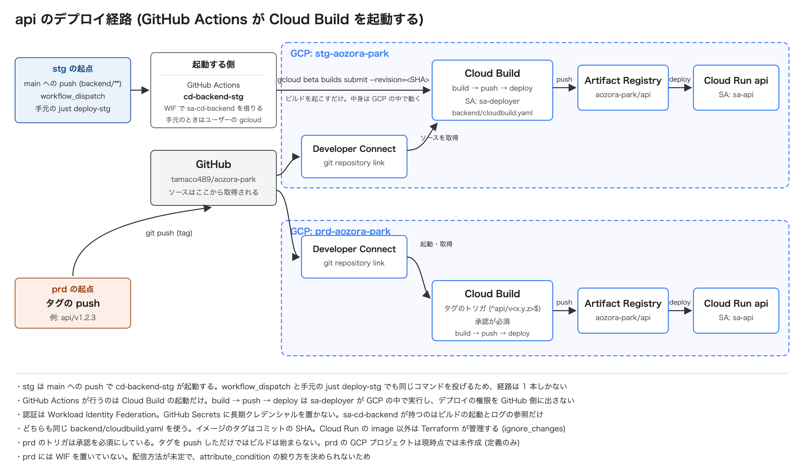

# backend のデプロイの構成

[English](./README.md) | [日本語](./README.ja.md)

[ドキュメント一覧](../../README.ja.md)に戻る。

backend のサービスを Cloud Run へ届ける経路をまとめます。手順は [backend の stg へのデプロイ](./stg.ja.md)にあります。
frontend を含めた全体の俯瞰は[デプロイの構成](../README.ja.md)にあります。
規約は `.claude/rules/cd/coding.md` が持ちます。ここには現状と、その形を選んだ理由を置きます。

## デプロイの経路

ビルドとデプロイは Cloud Build が GCP の中で実行します。ソースは GitHub から Developer Connect 経由で取得するため、手元の作業ツリーは関係しません。

**GitHub Actions が行うのは Cloud Build の起動だけです。** `cd-backend-stg` が `sa-cd-backend` を名乗って `gcloud beta builds submit` を投げ、
実際のビルドとデプロイは今までどおり `sa-deployer` が GCP の中で行います。手元から `just deploy-stg` を実行した場合と、起動する人が違うだけで経路は同じです。

## stg と prd の違い

| 項目                | stg                                                           | prd                                     |
| ------------------- | ------------------------------------------------------------- | --------------------------------------- |
| 自動の起点          | `main` への push (`backend/**`)                               | `<サービス名>/v1.2.3` の形のタグの push |
| 手で起こす          | `workflow_dispatch`、または `just deploy-stg <ref>`           | 無し                                    |
| 起動する主体        | `cd-backend-stg` の `sa-cd-backend`、または実行者             | Cloud Build のトリガ                    |
| デプロイ対象        | 常に全サービス (サービスごとに 1 ビルド)                      | タグの接頭辞が指すサービスだけ          |
| ビルドを実行する SA | `sa-deployer`                                                 | `sa-deployer`                           |
| 承認                | 無し                                                          | 必須                                    |
| ref                 | `github.sha`、または `just deploy-stg` の引数 (既定は `main`) | タグが指すコミット                      |
| イメージのタグ      | コミットの SHA                                                | コミットの SHA                          |
| 現在の状態          | 稼働中                                                        | GCP のプロジェクトは未作成。定義のみ    |

stg に Cloud Build のトリガを作らないのは、Developer Connect のリポジトリが手動のトリガに対応していないためです。
代わりに `gcloud builds submit` でビルドを直接投げます。GitHub Actions から起こす場合も同じコマンドを使います。

**そのため `gcloud beta builds submit` の引数と、デプロイ対象のサービス一覧が 2 か所にあります。** `.github/workflows/cd-backend-stg.yaml` と `backend/scripts/deploy-stg.sh` で、
片方を変更したらもう片方も直す必要があります。両方のファイルに相互参照のコメントを置いています。

タグを `<サービス名>/v1.2.3` の形にしたのは、サービスごとにトリガを分けるためです。
タグ名はスラッシュを含みイメージのタグに使えないため、イメージにはコミットの SHA を付けます。

## stg は常に全サービスをビルドします

サービスごとに `_SERVICE` を変えて別のビルドを投げます。1 回のビルドで 2 サービスを作る形にしないのは、
`cloudbuild.yaml` がダイジェストを書く `/workspace/image_digest.txt` が固定名で、同じビルドの中では衝突するためです。

変更の内容から対象を絞る判定は入れていません。`internal/platform` や `go.mod` を触ると結局どちらも対象になるため、
判定を持つほど「絞られたつもりで片方が古いまま残る」事故に近づきます。

**片方のビルドが落ちても、もう片方の結果が分かる形にしています。**

| 起こし方          | 仕組み                                                                 |
| ----------------- | ---------------------------------------------------------------------- |
| `cd-backend-stg`  | サービスを `strategy.matrix` に並べ、`fail-fast: false` で打ち切らない |
| `just deploy-stg` | スクリプトが順に投げ、落ちたサービス名をまとめて報告して 1 で終わる    |

ワークフローの `concurrency` は run 同士の直列化のためのもので、同じ run に属する matrix のジョブは待ち合わせません。

## 登場するリソース

| リソース                         | 役割                                                                    |
| -------------------------------- | ----------------------------------------------------------------------- |
| Developer Connect の接続         | GitHub との接続。OAuth トークンは Secret Manager に保存される           |
| git repository link              | 接続の下でリポジトリ 1 つを指す。Cloud Build はここからソースを取得する |
| Cloud Build                      | `backend/cloudbuild.yaml` に沿って build → push → deploy を実行する     |
| `sa-deployer`                    | ビルドとデプロイの実行 SA                                               |
| Artifact Registry `aozora-park`  | イメージの置き場所。最新 5 世代を残す                                   |
| Cloud Run `api`                  | api の実行環境。実行 SA は `sa-api`                                     |
| Cloud Run `priority-pass-issuer` | 優先パスの割当の実行環境。実行 SA は `sa-priority-pass-issuer`          |

`sa-deployer` の権限は必要な範囲に絞っています。

| ロール                                     | 付与先                            |
| ------------------------------------------ | --------------------------------- |
| `roles/artifactregistry.writer`            | リポジトリ `aozora-park`          |
| `roles/run.developer`                      | デプロイ対象の Cloud Run サービス |
| `roles/iam.serviceAccountUser`             | 各サービスの実行 SA               |
| `roles/developerconnect.readTokenAccessor` | プロジェクト                      |
| `roles/logging.logWriter`                  | プロジェクト                      |

最後の 2 つをプロジェクトに付けているのは、Developer Connect の接続とリンクがリソース単位の IAM を持たず、ログの書き込みもプロジェクトより下の単位で付けられないためです。

## Terraform との分担

| 対象                                      | 管理するもの                                       |
| ----------------------------------------- | -------------------------------------------------- |
| Cloud Run の設定 (SA・環境変数・スケール) | Terraform                                          |
| Cloud Run の `image`                      | デプロイ。Terraform は `ignore_changes` で無視する |
| Developer Connect の接続                  | 手作業で作成して認可し、Terraform に import する   |
| OAuth トークンのシークレット              | Developer Connect が作成する。Terraform は触らない |

接続を手作業で作るのは、GitHub の認可がブラウザでしか行えないためです。作成の手順は設計ドキュメントの「5. Developer Connect の接続」にあります。

## 採らなかった案

| 案                                | 採らなかった理由                                                             |
| --------------------------------- | ---------------------------------------------------------------------------- |
| GitHub Actions からの直接デプロイ | ビルドとデプロイの権限を GitHub 側に出すことになる。起動だけを任せれば足りる |
| Cloud Deploy                      | 環境が stg と prd の 2 つで、承認付きの段階的な配信までは要らない            |
| Artifact Analysis                 | 脆弱性スキャンは費用に見合う段階ではない。必要になった時点で入れる           |

### 一度は見送った 2 案を採りました

当初は「GitHub Actions + WIF」と「`main` へのマージで自動デプロイ」のどちらも採りませんでした。
懸念はそれぞれ次のように解消しています。

| 当初の懸念                                 | 解消した理由                                                                                                                                                                                                                                           |
| ------------------------------------------ | ------------------------------------------------------------------------------------------------------------------------------------------------------------------------------------------------------------------------------------------------------ |
| デプロイの権限を GitHub 側に出すことになる | **出していません。** `sa-cd-backend` に与えたのは Cloud Build の起動 (`cloudbuild.builds.editor`) とログの参照だけで、ビルドとデプロイは `sa-deployer` が GCP の中で行います。資格情報も WIF の短命なトークンで、GitHub Secrets には何も置いていません |
| stg に何が載っているかを意図して決めたい   | **決められます。** `just deploy-stg <ref>` と `workflow_dispatch` を残しているため、`main` とは違う内容を載せる手段があります。そのうえで既定を「`main` と同じ」にしました                                                                             |
