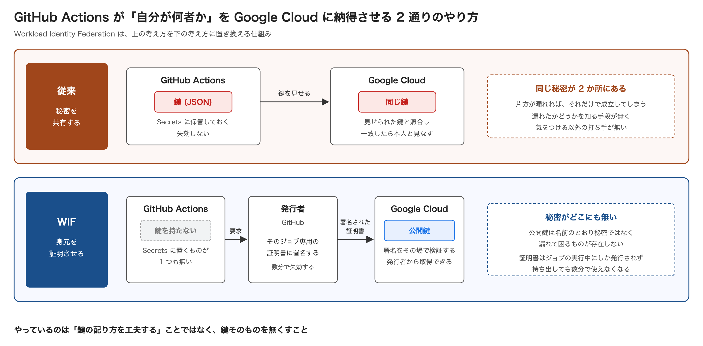
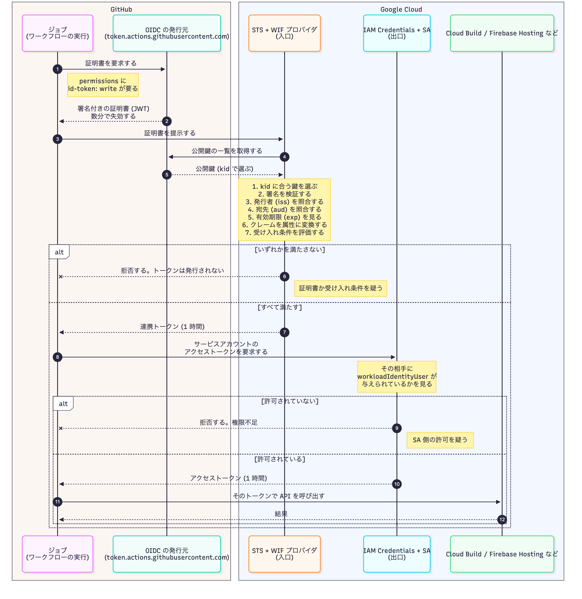

# Workload Identity Federation

[English](./README.md) | [日本語](./README.ja.md)

Back to the [documentation index](../../README.md).

This page describes how GitHub Actions reaches Google Cloud without any long-lived credentials.
For an overview of CD as a whole, see [Deployment architecture](../README.md).
The configuration itself lives in `infra/modules/github_oidc/`, and the conventions are in `.claude/rules/cd/coding.md`.

## 1. What problem it solves

To operate Google Cloud from GitHub Actions, a workflow has to convince Google Cloud of who it is.
There are broadly two ways to do that.

**The same idea exists on AWS and Azure as well.** This page describes the GitHub Actions and Google Cloud combination.



|             | The idea                | How it works                                                                      |
| ----------- | ----------------------- | --------------------------------------------------------------------------------- |
| Traditional | **Share a secret**      | Both sides hold the same key; presenting the key is accepted as proof of identity |
| WIF         | **Prove your identity** | A trusted issuer signs a certificate, which is verified on the spot               |

**Workload Identity Federation replaces the former with the latter.**
It is not about distributing the key more carefully; it is about **removing the key altogether.**

## 2. The traditional approach and its problems

A service account key (JSON) is issued and stored in GitHub Secrets.

```text
1. Issue a service account key in Google Cloud   a JSON file is downloaded
2. Store its contents in GitHub Secrets
3. The workflow authenticates to Google Cloud with that key on every job
```

It works, but the following problems come with it.

| Problem                      | Details                                                                                     |
| ---------------------------- | ------------------------------------------------------------------------------------------- |
| It never expires             | Valid from the moment it is created until someone deletes it by hand                        |
| Copies cannot be detected    | Google Cloud cannot tell a copy apart from legitimate use                                   |
| It works from anywhere       | Anyone holding it can present it, from any machine                                          |
| Rotation is manual           | It gets forgotten, and because it keeps working when forgotten, nobody notices              |
| The secret ends up scattered | GitHub Secrets, a local download, and the repository settings page all hold the same secret |

## 3. Why the problems do not go away

**Being careful does not remove them. The cause is the structure itself: the secret exists in two places.**

As long as both sides hold the same secret, a leak on either side is enough.
There is nothing to do beyond "be careful not to leak it", so the following always remains true.

- There is **no way to know** whether it leaked
- If it did leak, there is **no way to know since when**

Rotating more often narrows the window, but the structure is unchanged.

## 4. How WIF thinks about it

**Instead of sharing a secret, a certificate issued by a third party is verified on the spot.**
The key point is that the work splits into three roles.

| Role                  | Who performs it                         | What it does                                                                           |
| --------------------- | --------------------------------------- | -------------------------------------------------------------------------------------- |
| Issuer                | GitHub (the OIDC token issuer)          | Signs a certificate stating "this job belongs to this repository"                      |
| Verifier              | Google Cloud (STS and the WIF provider) | Checks the signature and decides whether the caller is acceptable                      |
| Holder of permissions | A service account                       | Lets **only a caller the verifier accepted** act as itself, and only for a short while |

**No key has to be handed out in advance because the signature proves who issued it.**
Google Cloud can fetch GitHub's public key, so there is no need to hold a secret up front.

### How the signature is produced

The certificate is a JWT: three parts joined with `.`.

```text
base64url(header) . base64url(claims) . signature
```

| Part      | Contents                                                                          |
| --------- | --------------------------------------------------------------------------------- |
| Header    | The signing algorithm (`alg`) and the identifier of the key used (`kid`)          |
| Claims    | The issuer, the audience, the expiry, the repository name, and similar assertions |
| Signature | **The header and claims joined together**, signed with the issuer's private key   |

**A signature is not encryption. It exists to detect tampering and to prove who issued the token.**
Anyone can read the claims. They are not there to hide anything.

- Changing a single character invalidates the signature
- **The private key never leaves the issuer.** Only the result of signing does
- Only the issuer holds that private key, so **nobody else can produce the same signature**

The issuer publishes the public keys needed for verification where anyone can fetch them.

```text
.../.well-known/openid-configuration   <- the entry point; lists the key location and supported algorithms
.../.well-known/jwks                   <- the public keys
```

For GitHub the only signing algorithm is `RS256`. There are currently four public keys, selected by `kid` so that they can be rotated.
Only the **public** components are published; nothing from the private key is included.

### How verification works, and what comes back

**This is the whole path, from receiving the certificate to calling an API.** Verification happens twice: once on the way in, once on the way out.



**The public key can simply be fetched, so nothing has to be held in advance.** That is what makes it possible to stop distributing keys.

If a check fails, no token is issued. **Where it failed tells you what to look at.**

- **Failed at the entrance (STS)** — suspect the certificate itself, or the acceptance condition
- **Failed at the exit (IAM Credentials)** — suspect the permission on the service account

### Three different tokens appear

**The names are similar, but the issuer and the lifetime differ.** This is the easiest part to confuse.

| Token            | Issued by        | Lifetime | Form             | Role                                       |
| ---------------- | ---------------- | -------- | ---------------- | ------------------------------------------ |
| OIDC token (JWT) | GitHub           | Minutes  | **Readable**     | Asserting an identity                      |
| Federated token  | Google Cloud STS | 1 hour   | An opaque string | A provisional identity inside Google Cloud |
| Access token     | IAM Credentials  | 1 hour   | An opaque string | **The actual API calls**                   |

**Only the JWT is readable.** The other two are opaque strings that reveal nothing about who holds them; Google Cloud keeps the mapping.

#### OIDC token (JWT)

Three parts separated by `.`. Because a signature is not encryption, **anyone can read the claims.**

```text
eyJhbGciOiJSUzI1NiIsImtpZCI6ImNjNDEzNTI3LTE3M2YtNWE...   <- header
.eyJqdGkiOiJkNzRmNGE2Mi0zYzkxLTRlMjgtOGY1YS0xYjJjM2Q...  <- claims
.BF8xZ3kQn2vYhL7tR4pWcM6sKjD9aXfE1gTbH5uNzOqI...        <- signature
```

Decoding the middle part from base64url gives something like this (the values are an example).

```json
{
  "iss": "https://token.actions.githubusercontent.com",
  "aud": "https://iam.googleapis.com/projects/1098169918715/locations/global/workloadIdentityPools/github/providers/github",
  "sub": "repo:tamaco489/aozora-park:ref:refs/heads/main",
  "repository": "tamaco489/aozora-park",
  "repository_owner": "tamaco489",
  "ref": "refs/heads/main",
  "workflow": "cd-api-stg",
  "run_id": "37199909169",
  "iat": 1760000000,
  "exp": 1760000300
}
```

**`repository` and `sub` are what the entrance condition matches against.**

#### Federated token

What STS returns in exchange for the JWT.

```json
{
  "access_token": "<a long opaque string>",
  "issued_token_type": "urn:ietf:params:oauth:token-type:access_token",
  "token_type": "Bearer",
  "expires_in": 3600
}
```

The identity it carries is not a service account but **the federated external identity.**

```text
principalSet://iam.googleapis.com/projects/1098169918715/locations/global/workloadIdentityPools/github/attribute.repository/tamaco489/aozora-park
```

#### Access token

What comes back after using the federated token to act as a service account.

```json
{
  "accessToken": "<a long opaque string>",
  "expireTime": "2026-10-04T12:47:50Z"
}
```

**Only here does the identity become the service account.**

```text
sa-cd-frontend@stg-aozora-park.iam.gserviceaccount.com
```

This is the token `gcloud` and `firebase` actually use.

### What happens to the problems from section 2

| Problem                      | Under WIF                                                                             |
| ---------------------------- | ------------------------------------------------------------------------------------- |
| It never expires             | **The certificate lasts minutes and the access token one hour**                       |
| Copies cannot be detected    | **There is nothing to copy.** The certificate is only issued while the job is running |
| It works from anywhere       | **It can only be obtained from a run that satisfies the conditions**                  |
| Rotation is manual           | **Not needed.** A new one is issued every time                                        |
| The secret ends up scattered | **There is nowhere to put it.** Nothing is registered in Secrets at all               |

## 5. How the caller is narrowed down

**Having two stages is what characterises WIF.** Either one alone is not enough.

| Stage    | Where                                                       | What it does                                                                         |
| -------- | ----------------------------------------------------------- | ------------------------------------------------------------------------------------ |
| Entrance | The provider's acceptance condition (`attribute_condition`) | A certificate that fails the condition cannot be exchanged for a token at all        |
| Exit     | The permission on the SA (`roles/iam.workloadIdentityUser`) | Even after the exchange, only a caller with the allowed attribute can act as that SA |

**The two stages exist because they protect different things.**

- The entrance decides **who gets in at all**. Since the issuer is a public service, omitting this lets any repository in
- The exit decides **which permissions an admitted caller may use**. Each SA can allow a different set of callers

Passing the entrance does not let you act as an SA that has not allowed you at the exit, and allowing a caller at the exit is meaningless if it cannot pass the entrance.

In this project:

```text
Entrance: assertion.repository == 'tamaco489/aozora-park'
Exit:     workloadIdentityUser for principalSet://.../attribute.repository/tamaco489/aozora-park
```

## 6. Things that are easy to confuse

### There are two things called "provider"

|                   | The issuing side                                         | The accepting side                                            |
| ----------------- | -------------------------------------------------------- | ------------------------------------------------------------- |
| What it is        | A GitHub service (`token.actions.githubusercontent.com`) | A Google Cloud resource (the Workload Identity pool provider) |
| Who owns it       | **GitHub**                                               | **Your own project**                                          |
| Can you define it | **No**                                                   | **Yes. This is the thing you configure**                      |
| What it does      | **Issues** certificates                                  | **Decides which certificates to accept**                      |

The issuer URL in the configuration does not define the issuer. It is only a statement that **"signatures from this issuer are trusted".**

### Requesting a certificate is not a Google Cloud permission

`id-token: write` is the permission to **make GitHub issue your identity document**; it grants nothing on Google Cloud.
What Google Cloud admits is decided by the two stages in "5. How the caller is narrowed down".

### There is nothing to configure on the GitHub side

GitHub works on the assumption that it **hands a certificate to anyone who asks.**
The design is that **the receiving side inspects it and narrows down**, so there is no setting to register on the GitHub side.

## 7. What WIF does not solve

Removing the key is not a cure-all.

| Remaining concern                       | Details                                                                                                                  |
| --------------------------------------- | ------------------------------------------------------------------------------------------------------------------------ |
| Permission design is a separate problem | Narrowing the entrance does not help if the service account itself is powerful. **Roles must be scoped separately**      |
| A loose condition is still loose        | Without an acceptance condition, **any repository gets through**. Trusting a public issuer makes the condition mandatory |
| Inside a job it works normally          | If malicious code reaches the workflow, **it can use the token while that run lasts**. That is unrelated to keys         |
| Lifetime limits                         | An access token lasts one hour by default, so longer work can hit an expiry                                              |
| Recreation limits                       | A pool or provider ID cannot be reused for 30 days after deletion                                                        |

## 8. Alternatives

WIF is not the only way to avoid storing a key.

| Option                           | Needs a key                              | What it costs                                             |
| -------------------------------- | ---------------------------------------- | --------------------------------------------------------- |
| **WIF (what this project uses)** | **No**                                   | Slightly more concepts to configure                       |
| A self-hosted runner             | No (permissions attach to the runner)    | Running the machine, and paying for it continuously       |
| Not using GitHub Actions         | No (deployments run with your own login) | No record of the run, so deployments get forgotten        |
| A service account key            | **Yes**                                  | Carries every problem listed for the traditional approach |

**If the requirement is to keep a record of every deployment without storing a key, WIF is the one that fits.**
