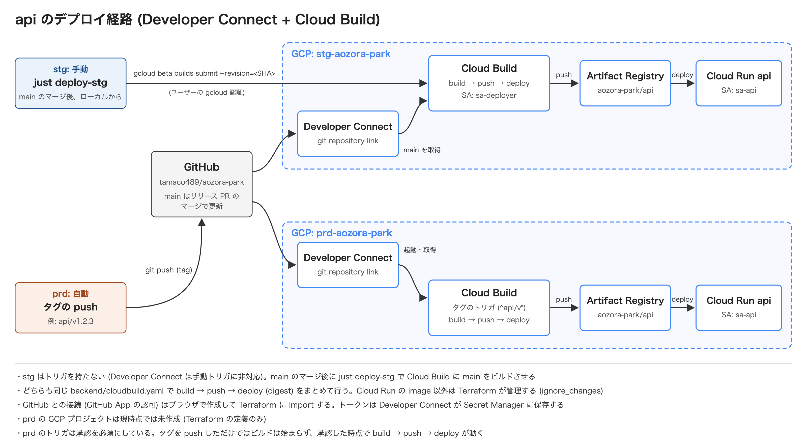

# デプロイの構成

[English](./overview.md) | [日本語](./overview.ja.md)

[ドキュメント一覧](../README.ja.md)に戻る。

api を Cloud Run へ届ける経路をまとめます。手順は [stg へのデプロイ](./stg.ja.md)にあります。
規約は `.claude/rules/ci/coding.md` の「CD」が持ちます。ここには現状と、その形を選んだ理由を置きます。

## デプロイの経路

ビルドとデプロイは Cloud Build が GCP の中で実行します。ソースは GitHub から Developer Connect 経由で取得するため、手元の作業ツリーは関係しません。

## stg と prd の違い

| 項目           | stg                                | prd                                     |
| -------------- | ---------------------------------- | --------------------------------------- |
| 起こし方       | 手元からの `just deploy-stg <ref>` | `api/v1.2.3` の形のタグの push          |
| トリガ         | 作らない                           | Cloud Build のトリガ (Terraform で定義) |
| 承認           | 無し                               | 必須                                    |
| ref の既定     | `main`                             | タグが指すコミット                      |
| イメージのタグ | コミットの SHA                     | コミットの SHA                          |
| 現在の状態     | 稼働中                             | GCP のプロジェクトは未作成。定義のみ    |

stg にトリガを作らないのは、Developer Connect のリポジトリが手動のトリガに対応していないためです。
代わりに `gcloud builds submit` でビルドを直接投げます。

タグを `api/v1.2.3` の形にしたのは、サービスが増えたときにトリガを分けるためです。
タグ名はスラッシュを含みイメージのタグに使えないため、イメージにはコミットの SHA を付けます。

## 登場するリソース

| リソース                        | 役割                                                                    |
| ------------------------------- | ----------------------------------------------------------------------- |
| Developer Connect の接続        | GitHub との接続。OAuth トークンは Secret Manager に保存される           |
| git repository link             | 接続の下でリポジトリ 1 つを指す。Cloud Build はここからソースを取得する |
| Cloud Build                     | `backend/cloudbuild.yaml` に沿って build → push → deploy を実行する     |
| `sa-deployer`                   | ビルドとデプロイの実行 SA                                               |
| Artifact Registry `aozora-park` | イメージの置き場所。最新 5 世代を残す                                   |
| Cloud Run `api`                 | api の実行環境。実行 SA は `sa-api`                                     |

`sa-deployer` の権限は必要な範囲に絞っています。

| ロール                                     | 付与先                   |
| ------------------------------------------ | ------------------------ |
| `roles/artifactregistry.writer`            | リポジトリ `aozora-park` |
| `roles/run.developer`                      | Cloud Run の `api`       |
| `roles/iam.serviceAccountUser`             | `sa-api`                 |
| `roles/developerconnect.readTokenAccessor` | プロジェクト             |
| `roles/logging.logWriter`                  | プロジェクト             |

最後の 2 つをプロジェクトに付けているのは、Developer Connect の接続とリンクがリソース単位の IAM を持たず、ログの書き込みもプロジェクトより下の単位で付けられないためです。

## Terraform との分担

| 対象                                      | 管理するもの                                       |
| ----------------------------------------- | -------------------------------------------------- |
| Cloud Run の設定 (SA・環境変数・スケール) | Terraform                                          |
| Cloud Run の `image`                      | デプロイ。Terraform は `ignore_changes` で無視する |
| Developer Connect の接続                  | 手作業で作成して認可し、Terraform に import する   |
| OAuth トークンのシークレット              | Developer Connect が作成する。Terraform は触らない |

接続を手作業で作るのは、GitHub の認可がブラウザでしか行えないためです。作成の手順は設計ドキュメントの「5. Developer Connect の接続」にあります。

## 採らなかった案

| 案                            | 採らなかった理由                                                                     |
| ----------------------------- | ------------------------------------------------------------------------------------ |
| GitHub Actions + WIF          | デプロイの権限を GitHub 側に出すことになる。Cloud Build なら GCP の中で完結する      |
| main へのマージで自動デプロイ | stg に何が載っているかを意図して決めたい。マージと同時に動くと戻す判断が間に合わない |
| Cloud Deploy                  | 環境が stg と prd の 2 つで、承認付きの段階的な配信までは要らない                    |
| Artifact Analysis             | 脆弱性スキャンは費用に見合う段階ではない。必要になった時点で入れる                   |
