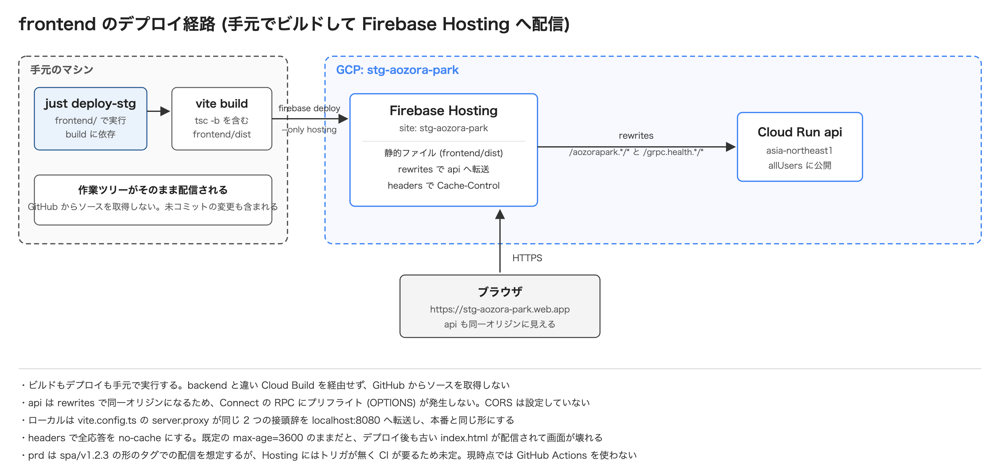

# デプロイの構成

[English](./overview.md) | [日本語](./overview.ja.md)

[ドキュメント一覧](../README.ja.md)に戻る。

このプロジェクトには、仕組みの異なる 2 つのデプロイの経路があります。ここでは両方を俯瞰します。
それぞれの詳細は [backend のデプロイの構成](../backend/deploy/overview.ja.md)と [frontend のデプロイの構成](../frontend/deploy/overview.ja.md)にあります。

## 2 つの経路

|                  | backend (api)                              | frontend                            |
| ---------------- | ------------------------------------------ | ----------------------------------- |
| 配信先           | Cloud Run                                  | Firebase Hosting                    |
| ビルドの実行場所 | **Cloud Build (GCP の中)**                 | **手元**                            |
| ソースの取得元   | GitHub (Developer Connect 経由)            | 手元の作業ツリー                    |
| 未コミットの変更 | 反映されない                               | **反映される**                      |
| 起こし方 (stg)   | `cd backend && just deploy-stg <ref>`      | `cd frontend && just deploy-stg`    |
| ロールバック     | `gcloud run services update-traffic`       | Firebase コンソールでリリースを選ぶ |
| prd              | `api/v1.2.3` の形のタグの push。承認が必須 | 未定                                |

**backend は「GitHub にあるものを GCP がビルドする」、frontend は「手元のものを手元がビルドして置く」**という違いです。

backend を GCP の中でビルドするのは、イメージの作成に時間がかかり、実行環境を固定したいためです。
frontend は静的ファイルを作るだけで数秒で終わるため、手元で完結させています。

## 共通する方針

- **現時点ではデプロイを GitHub Actions で行いません。** Actions は検査だけを行います。自動デプロイ (`cd-frontend` / `cd-infra`) は設計にありますが未実装で、Workload Identity Federation の構築が前提です
- 自動化する場合も、長期のクレデンシャルをリポジトリと GitHub Secrets に置かない方針は変えません。GCP への認証は WIF を使います
- stg は手元から 1 コマンドで起こします。どちらも `just deploy-stg` という同じ名前のレシピです
- prd は GCP のプロジェクトが未作成のため、構成の定義だけを持ちます

## api への経路

frontend から api への通信は、**Firebase Hosting の `rewrites` が Cloud Run へ転送します。**

```text
ブラウザ ──> Firebase Hosting ──rewrites──> Cloud Run (api)
                    │
                    └── 静的ファイル (frontend/dist)
```

ブラウザから見ると api は同一オリジンにあるため、プリフライト (`OPTIONS`) が発生しません。
CORS は設定していません。理由は [frontend のデプロイの構成](../frontend/deploy/overview.ja.md)にあります。

Cloud Run は `allUsers` に公開したままです。Hosting からの転送は内部トラフィック扱いにならないためです。

## それぞれの図

図は各領域のドキュメントが持ちます。ここでは両方を並べます。

### backend


### frontend



## 詳細

| ドキュメント                                                   | 内容                                                 |
| -------------------------------------------------------------- | ---------------------------------------------------- |
| [backend のデプロイの構成](../backend/deploy/overview.ja.md)   | Cloud Build と Developer Connect、Terraform との分担 |
| [backend の stg へのデプロイ](../backend/deploy/stg.ja.md)     | 手順、疎通確認、ロールバック                         |
| [frontend のデプロイの構成](../frontend/deploy/overview.ja.md) | rewrites とキャッシュ、採らなかった案                |
| [frontend の stg へのデプロイ](../frontend/deploy/stg.ja.md)   | 手順、疎通確認、ロールバック                         |

規約は `.claude/rules/ci/coding.md` の「CD」が持ちます。ここには現状と、その形を選んだ理由を置きます。
